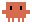
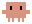
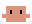

# Notchify


A pixel mascot for [Claude Code](https://claude.ai/code) that lives in your MacBook's notch and reacts to what Claude is doing.

**Requires:** macOS 12+, MacBook with a notch (Pro/Air 2021+), Claude Code CLI.

---

## Install

### Homebrew (recommended)

```sh
brew tap kikudjira/notchify
brew trust kikudjira/notchify   # recent Homebrew requires trusting third-party taps
brew install notchify
notchify launch      # starts the app and enables all hooks automatically
```

> **Note:** If you skip `brew trust`, Homebrew refuses to load the formula with
> `Refusing to load formula ... from untrusted tap`. Run the trust command above (or
> `brew trust --formula kikudjira/notchify/notchify`) and retry `brew install`.

That's it. Hooks are enabled on first launch. To adjust sounds, display position, or intro/outro animation:

```sh
notchify config
```

### Build from source

```sh
git clone https://github.com/kikudjira/notchify
cd notchify
./scripts/build.sh   # requires Xcode CLI tools: xcode-select --install
./scripts/setup.sh   # installs CLI, configures hooks, optionally adds login item
```

---

## Update

Homebrew:

```sh
notchify quit
brew update
brew upgrade notchify
notchify launch
```

From source:

```sh
cd notchify
git pull
./scripts/build.sh
./scripts/setup.sh
```

Check installed version: `brew list --versions notchify`.

---

## What it shows

| State     | When                                   | Animation |
|-----------|----------------------------------------|-----------|
| `start`   | You run `claude` in the terminal       |  |
| `working` | Claude is processing / using a tool    |  |
| `waiting` | Claude needs your attention            |  |
| `done`    | Claude finished a turn                 |  |
| `error`   | Something went wrong                   | — |
| `bye`     | You exit `claude`                      |  |
| `idle`    | Mascot hidden                          | — |

---

## Config

Run `notchify config` to open the interactive menu.

### Integrations

Everything Notchify wires into Claude lives here: the Claude Code event hooks and the shell wrapper that plays the intro/outro animations. A single **Integrations** master toggle at the top of the submenu flips all of them on or off at once.

Claude Code triggers that drive the animations:

| Hook    | Claude Code event                         | Animation  |
|---------|-------------------------------------------|------------|
| working | `UserPromptSubmit`, `PostToolUse`         | working    |
| done    | `Stop`                                    | done       |
| waiting | `Notification`, `PermissionRequest`       | waiting    |

Hooks are written to `~/.claude/settings.json` and enabled automatically on first `notchify launch`.

**Shell wrapper (intro/outro animation).** Wraps the `claude` shell command so `start` plays when you open a session and `bye` plays when you close it. Adds a `claude()` function to `~/.zshrc` / `~/.bashrc`. Restart the terminal or run `source ~/.zshrc` after enabling.

**Multiple Claude accounts.** If you split accounts via `CLAUDE_CONFIG_DIR` (e.g. `~/.claude-work`, `~/.claude-personal`), open `notchify config → Integrations → Config targets` and tick every directory that should get animations. The list is saved to `~/.config/notchify/hook_targets.json` and every hook toggle / reinstall propagates to all selected targets. Unchecking a directory (or removing it via CLI) strips Notchify's hooks from its `settings.json` before forgetting it — any unrelated hooks in that file are preserved. CLI equivalents:

```sh
notchify hooks targets list
notchify hooks targets add ~/.claude-work
notchify hooks targets remove ~/.claude-work
notchify hooks reinstall                       # re-apply current state to every target
notchify hooks reinstall --config-dir ~/.x     # one-off override, repeatable
```

### Sounds

Assign a sound to each state. Changes take effect immediately — no restart needed.

Sounds are stored in `~/.config/notchify/sounds.json`. If the file doesn't exist, built-in defaults are used (Hero → start, Glass → done, Ping → waiting, Basso → error).

Available system sound names: Hero, Glass, Ping, Basso, Blow, Bottle, Frog, Funk, Morse, Pop, Purr, Sosumi, Submarine, Tink.

Custom file example: `{ "file": "~/sounds/done.mp3" }`. Set to `null` to disable a state.

Top-level `volume` (0.0–1.0) applies to every sound and is scaled further by the macOS system output level. Example: `{ "volume": 0.4, "start": { "system": "Hero" }, ... }`. Missing or `1.0` means full volume.

### Login item

Registers Notchify as a launchd agent (`~/Library/LaunchAgents/com.notchify.app.plist`) so it starts automatically at login.

### Display

Arrow-key TUI to position the mascot. Settings persist in `~/.config/notchify/display.json` and apply live — no restart.

| Field        | Keys              | What it does                                                |
|--------------|-------------------|-------------------------------------------------------------|
| Screen       | `↑↓` `enter`      | Pick a specific display, or `Auto` (always the notch screen). `✓` marks the active one. |
| Horizontal   | `←` / `→`         | Shift the mascot horizontally in points (negative = left).  |
| Vertical     | `←` / `→`         | Shift vertically (negative = up into the notch).            |
| Direction    | `space`           | Flip the mascot to face `→ right` or `← left`.              |
| Reset offsets| `enter`           | Set horizontal and vertical back to `0 pt`.                 |

`q` / `b` exit the menu.

---

## Uninstall

Homebrew:

```sh
notchify quit
brew uninstall notchify
brew untap kikudjira/notchify
```

Tip: run `notchify config → Integrations` and flip the master toggle off **before** uninstalling — it strips Claude Code hooks from every configured target and removes the `claude()` shell wrapper in one step.

Optional cleanup of leftovers:

- `~/Library/LaunchAgents/com.notchify.app.plist` — login item
- `claude()` function in `~/.zshrc` / `~/.bashrc` — intro/outro wrapper (handled by the master toggle)
- `~/.config/notchify/` — sounds, display, and hook target list
- Hooks in `<each configured target>/settings.json` (default `~/.claude/settings.json`) — entries that call `notchify set ...` (handled by the master toggle)

---

## Troubleshooting

- **Mascot doesn't appear** — confirm your MacBook actually has a notch (Pro/Air 2021+). Try `notchify launch` again, then `notchify set working` to force a frame.
- **Hooks don't fire** — open `notchify config → Integrations` and toggle them on. Make sure `~/.claude/settings.json` is valid JSON.
- **No animations from `claude-work` / `claude-personal`** — you split Claude config dirs via `CLAUDE_CONFIG_DIR` but hooks live only in `~/.claude/settings.json`. Open `notchify config → Integrations → Config targets`, tick every directory you use, save.
- **Mascot on the wrong screen** — `notchify config → Display`, pick a specific screen or `Auto`.
- **Intro/outro doesn't play** — open a new terminal or run `source ~/.zshrc` after enabling.
- **Stuck animation** — `notchify clear` resets all states without quitting the app.

---

## CLI reference

```sh
notchify launch              # launch the app (enables hooks on first run)
notchify quit                # quit the running app
notchify clear               # clear all stuck animations (keeps the app running)
notchify config              # interactive config (hooks, sounds, display, login item)
notchify set <state>         # send a state manually (working / waiting / done / error / start / bye / idle)
notchify hooks targets list  # list Claude config dirs receiving hooks
notchify hooks targets add <path>     # add a config dir (e.g. ~/.claude-work)
notchify hooks targets remove <path>  # remove a config dir
notchify hooks reinstall     # re-apply current hook state to every target
notchify help                # show help
```

`--config-dir <path>` works with `launch` and `hooks reinstall` to override the
configured targets for that single invocation; pass it multiple times for several dirs.

---

## Custom animations

Frames are PNG files in the resource bundle. To replace an animation:

1. Export frames as `<state>_00.png`, `<state>_01.png`, … at 60×36 px
2. Drop them into `Sources/Notchify/Resources/`
3. Run `./scripts/build.sh`

Source files (`.piskel`) are in `piskel/`.

| State     | Frame files                           | Plays |
|-----------|---------------------------------------|-------|
| `start`   | `start_00.png` …                      | once  |
| `working` | `work_0.png` … `work_2.png`           | loop  |
| `waiting` | `wait_00.png` … `wait_07.png`         | loop  |
| `done`    | `done_00.png` … `done_03.png`         | once  |
| `bye`     | `bye_00.png` …                        | once  |

---

## Project structure

```
Sources/
  Notchify/              main GUI app (NSPanel overlay, SwiftUI canvas)
    CrabRenderer.swift   pixel animation renderer
    StatusServer.swift   Unix socket IPC server (/tmp/notchify.sock)
    NotchWindowController.swift  notch-area window positioning
  notchify-cli/                CLI binary
    main.swift                 command dispatcher
    Configurator.swift         interactive config TUI
    HooksConfig.swift          read/write Claude Code hooks across all targets
    HookTargetsConfig.swift    list of Claude config dirs receiving hooks
    DisplayConfig.swift        screen, offsets, mascot direction
    SoundsConfig.swift         per-state sound assignments
    LoginItemConfig.swift      launchd agent registration
    ShellWrapperConfig.swift   intro/outro shell wrapper
    Terminal.swift             raw-mode key input
    ANSI.swift                 ANSI colors / cursor helpers
scripts/
  build.sh               compile + create Notchify.app bundle
  setup.sh               install CLI, hooks, login item (from-source installs)
piskel/                  animation source files (.piskel + PNG frames)
```

---

## Contributing

```sh
./scripts/build.sh
pkill -f Notchify; open Notchify.app
notchify set working    # test a state
```

The CLI and app communicate over a Unix domain socket at `/tmp/notchify.sock` using plain-text status names.

---

## License

MIT — see [LICENSE](LICENSE).
